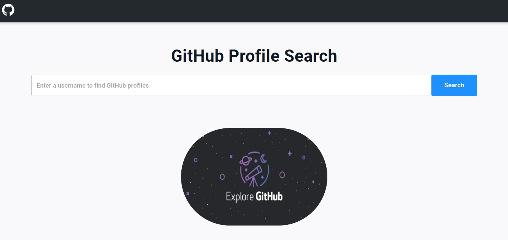

# GitHub_Explorer

fetching and displaying GitHub user profile data. search for any GitHub user by their username, and let GitHubExplorer provide you with a snapshot of their GitHub activity, repositories, followers, and more.

## Try It Out

Check out the live demo of this project on [Netlify](https://saad-elm-github-explorer.netlify.app/).

